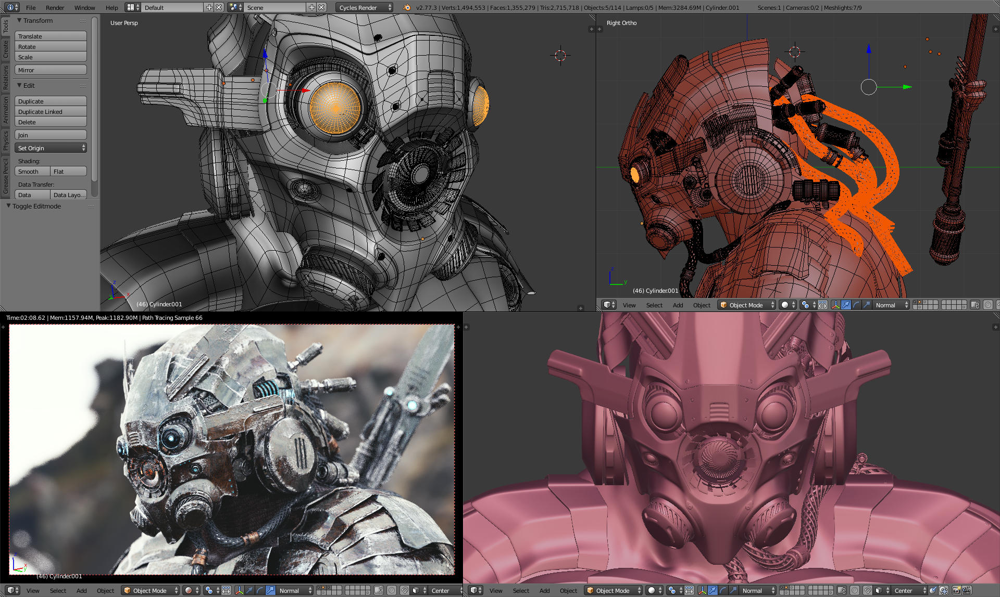

## He-Arc Low Poly

dépôt git: [https://github.com/groovytron/arc-low-poly](https://github.com/groovytron/arc-low-poly)

---

## Sommaire

* Objectifs du projet
* Billboards et leurs avantages
* Logiciels utilisés
* Blender et ses avantages
* Problèmes rencontrés
* Solution finale
* Atteinte des objectifs et améliorations possibles
* Démonstration
* Questions

---

## Objectifs du projet

* Modéliser une table en billboards.
* L'exporter au format _.obj_.
* Afficher le modèle dans une page web.
* Proposer un minimum d'interaction avec la table (rotation, translation, ...).
* Affichage de plusieurs tables dans une salle de classe (__secondaire__).
* Modéliser un deuxième meuble (__secondaire__).

---

## Billboard

---

## Avantages des billboards

* Simplification du modèle (__moins de polygones__).
* Économique en calculs (__gain de performances__).
* Utilisé pour des modèles complexes (plantes).

---

## Logiciels utilisés

* Modélisation: [Blender](https://www.blender.org/)
* Rendu: [WebGL](https://www.khronos.org/webgl/)
* Chargement du modèle dans WebGL: bibliothèque
  [webgl-obj-loader](https://github.com/frenchtoast747/webgl-obj-loader)
  d'Aaron Boman.

---

## Blender

{width=700px}

---

## Avantages des logiciels de modélisation tridimensionnelle

* Création de modèles complexes simplifiée.
* Rendu en temps réel.
* Exportation des modèles simple et en différents formats (_.obj_, _.json_, ...).

<!--
## WebGL

* Outil d'infographie pour le web.
* Possibilité de rendus en temps réel en profitant de la puissance de la carte
  graphique.
-->
---

## Problèmes rencontrés

* Modélisation de la table en billboards.
* Pose des textures sur les bonnes faces du modèle.
  (~~[obj-mtl-loader](https://github.com/tiansijie/ObjLoader)~~)

<aside class="notes">
    * Comprendre en profondeur comment créer un billboard à partir d'un modèle
      détaillé.
    * La modélisation a pris du temps.
    * obj-mtl-loader: compilation avec Webpack pour une utilisation côté client.
    * Comment poser les textures sur les bonnes faces?
      --> Utiliser une texture unique
      --> webgl-obj-loader suffit pour ce cas
</aside>

---

## Solution finale

* Billboard modélisé avec Blender (prises sous différents plans et uv mapping)
* Chargement du fichier _.obj_ avec _webgl-obj-loader_.
* Chargement d'une texture unique (facilite la gestion dans les shaders)

<aside class="notes">
    * Parallélipipède rectangle sur lequel on pose des coupes sur
      chacune de ses faces.
    * Une texture --> un sampler2d côté shader.
    * On a tout ce qui nous faut avec webgl-obj-loader (vertices,
      indices, normales, coordonnées de textures, etc.)
</aside>

---

## Atteinte des objectifs

* Table modélisée en billboards.
* Modèle chargé dans WebGL (avec [ombrage de Lambert](https://fr.wikipedia.org/wiki/Ombrage_plat))
* Possibilité d'interaction (rotation et translation)

---

## Améliorations possibles

* Régler les problèmes de transparence.
* Afficher plus de tables.
* Rendu d'une salle.
* Modéliser des chaises.

---

## Démonstration

[Application hébergée chez GitHub](https://groovytron.github.io/arc-low-poly/)

---

## Questions?

---

## Sources

* Extreme Graphical Simplification: [http://web.cs.wpi.edu/~emmanuel/MQPs/extreme_simplification/data.htm](http://web.cs.wpi.edu/~emmanuel/MQPs/extreme_simplification/data.htm)
